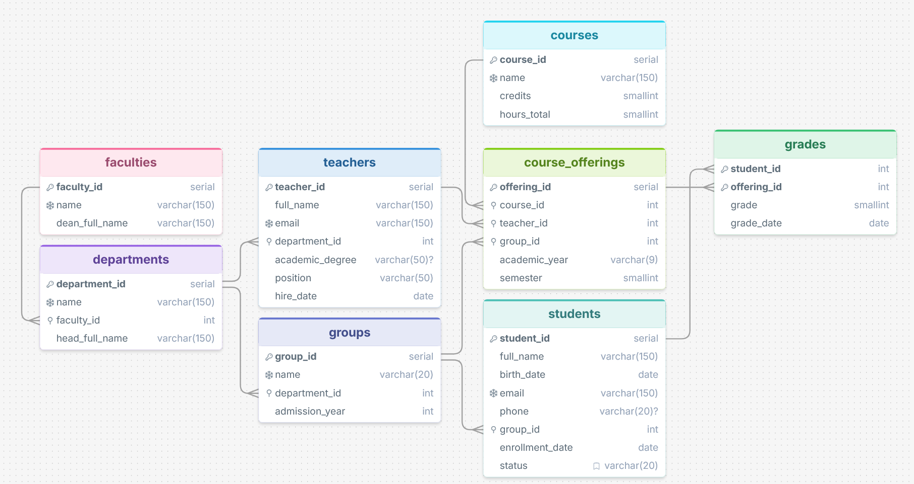

### Вариант 3
Информационная система университета.  
#### Предметная область
Университет состоит из факультетов, на каждом из которых работает несколько кафедр. Кафедра готовит студентов по учебным группам и в ней числятся преподаватели. Каждая кафедра предлагает дисциплины, которые в конкретном семестре и учебном году читаются конкретной группе конкретным преподавателем («предложение дисциплины», offering). По итогам обучения студент получает оценку за конкретное предложение дисциплины.  

Ключевые правила:
- Факультет нельзя удалить, пока на нём есть кафедры.
- Кафедру нельзя удалить, пока к ней привязаны группы или преподаватели.
- Группу/дисциплину/преподавателя нельзя удалить, пока есть связанные предложения дисциплин — иначе потеряется история.
- Если удаляют студента или конкретное предложение дисциплины — все его оценки теряют смысл и удаляются каскадно, так как оценка не существует без студента и без предложения дисциплины.
- Один студент может получить только одну оценку за одно и то же предложение дисциплины.
- Одна и та же дисциплина в одной и той же группе, в одном и том же семестре и учебном году может преподаваться только один раз.

#### Таблицы

| Таблица             | Назначение                                             |
|---------------------|--------------------------------------------------------|
| `faculties`         | Факультеты университета                                |
| `departments`       | Кафедры (принадлежат факультету)                       |
| `groups`            | Учебные группы (принадлежат кафедре)                   |
| `teachers`          | Преподаватели (числятся на кафедре)                    |
| `students`          | Студенты (числятся в группе)                           |
| `courses`           | Дисциплины (справочник)                                |
| `course_offerings`  | Факт преподавания дисциплины группе в семестре/году    |
| `grades`            | Оценки студентов за offering                           |

#### ER-диаграмма

#### Обоснование приведения к 3НФ
`1НФ`: все атрибуты атомарны (все значения — скаляры, повторяющихся групп атрибутов нет).

---

`2НФ`: составной первичный ключ есть только в grades — (student_id, offering_id). Атрибуты grade и grade_date зависят от всей пары ключа целиком, частичной зависимости от части ключа нет.  

---

`3НФ`: устранены все транзитивные зависимости:
- В students не хранится название группы/кафедры/факультета. Вместо этого хранится только group_id.
- В course_offerings не хранится ни имя преподавателя, ни название дисциплины, ни название группы — только их ключи.
- В teachers/departments не дублируется название факультета.
- В grades не хранится ни имя студента, ни название дисциплины — только ключи student_id и offering_id.  
Таким образом, каждый неключевой атрибут зависит только от первичного ключа своей таблицы и ни от чего больше — транзитивных и частичных зависимостей нет, модель находится в 3НФ.